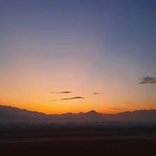
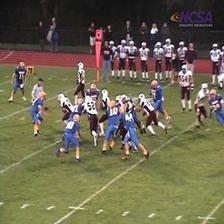

  

# Project Beautif.ai Image Classification

## Group 2 - Team 1
Team Members:
* [Jasmina Lavchanska - Nikolovska ( Team Leader )](https://github.com/jasminalavcanskanikolovski)
* [Dimitri Kjososki](https://github.com/sat135)
* [Ivica Todorovski](https://github.com/IvicaTodorovski)
* [Tina Stefanovska](https://github.com/tinastefanovska)
* [Polad Emin](https://github.com/polademin)

# Project Title: Beautif.ai

 * [Description](https://github.com/sat135/Brainster_G2_T1_Beautifai#description)
 * [How does it work?](https://github.com/sat135/Brainster_G2_T1_Beautifai#how-does-it-work)
 * [The process](https://github.com/sat135/Brainster_G2_T1_Beautifai#the-process)
   * [Phase 1: Dataset creation](https://github.com/sat135/Brainster_G2_T1_Beautifai#phase-1-dataset-generation)
   * [Phase 2: Training the model](https://github.com/sat135/Brainster_G2_T1_Beautifai#phase-2-training-the-model)
   * [Phase 3: Validation](https://github.com/sat135/Brainster_G2_T1_Beautifai#phase-3-validation)
   * [Phase 4: Deployment](https://github.com/sat135/Brainster_G2_T1_Beautifai#phase-4-deployment)
 * [Summary of results](https://github.com/sat135/Brainster_G2_T1_Beautifai#summary-of-results)

## Description

Beautif.ai is an ios mobile application designed to edit and enhance pictures on a mobile device meant for personal and business usage. The goal of the project is to create a robust classifier that will be able to detect whether an image consists of Daylight Sky, Night Sky, or No sky at all. Furthermore, during the dataset collection phase, the team decided that one more class should be added in order to identify whether the sky in the night photos is well separated or not. The final set of classes is:
 * Daylight Sky
 * Night sky which can be separated
 * Night Sky without well-defined separation points
 * Images without sky (indoor or outdoor). 

The model will be integrated into the application for further use.

## How does it work?

This model will find use in recognizing and separating the sky from the rest of the objects on the photo. Once a picture is taken, the application by itself will recognize if there is a sky at all, and then recognize if it is a day or night in order to identify if sky-algorithm should be offered as an option to the user to edit the sky.

## The process

The project implementation was divided into 3 phases:

Phase 1: Dataset Generation
  * Dataset Collection
  * Dataset Preparation

Phase 2: Training the model
  * Compose neural network architectures
  * Ping Pong phase with Dataset labelers
  * Fine-tuning of the model

Phase 3: Validation
  * Analysis and benchmark Precision/Recall
  * Predictions of random images

Phase 4: Deployment
  * Real-life application

### Phase 1: Dataset Generation

In order to train a deep-learning model regarding requests, we needed an appropriate dataset with a balanced distribution of images for the four above-stated classes. 
One of the challenges we met during this project was collecting the data. We decided to combine images from the existing dataset and private photos from the team members. This approach was selected in order to have high diversity in the dataset since the time and resources of the team members were limited. The existing data is [The Places365 dataset](http://places2.csail.mit.edu/download.html). The dataset, belonging to MIT’s Computer Science and Artificial Intelligence Laboratory, is designed following principles of human visual cognition, created specifficaly to train artificial systems for high-level visual understanding tasks, such as scene context, object recognition, action and event prediction, and theory-of-mind inference. In total, Places contains more than 10 million images comprising 400+ unique scene categories. Having in mind that the entire dataset contains 10 million images of different resolution scales, we are only using the 15% of validation images of the High-resolution images subset, i.e. 5475 images.
Data preparation consisted of labeling, renaming, and resizing the collected dataset.
The final dataset (available [here](https://drive.google.com/drive/folders/14aPhB-LHJTDZethUfNkBkM80b1Cm5fAE?usp=sharing)) cosists of **8640** images with train - validation split of 85% - 15%:

Class Name | Number of images | Example 1 | Example 2 | Example 3 | Example 4 | Example 5
------------ | ------------- | ------------- | ------------- | ------------- | ------------- | -------------
Daylight Sky | 3304 |  |  |  |  | 
Night sky separated | 658 |  | |  |  | 
Night sky not separated | 887 |  |  |  |  | 
No sky | 3791 |  |  |  |  | 

Set distribution by class is shown below:

  

### Phase 2: Training the model

To solve this problem, we have tried several image classifiers that classify one of four categories. To construct this classifier, we used pre-trained CNN:
 * ResNet50
 * ResNet101
 * ResNet152
 * Xception
 * VGG16
 * VGG19
 * InceptionV3
 * InceptionResNetV2
 * DenseNet201
 * DenseNet169

Even though most of the validation accuracy was over 80%, the best performing models were ResNet models, particularly ResNet101. The best result based on validation accuracy is  **90.825%** which was achieved with transfer-learning using pre-trained ResNet101, with no re-trained layers, using 50 epoch, Batch size of 15, and added dropout and batch normalization layers in order to prevent overfitting (available [here](https://drive.google.com/drive/folders/1KxT-R_9ulmCX2P2GAVTQXSdlZktIZsTF?usp=sharing)).

### Phase 3: Validation

Validation of the model results was done on the Validation set and on about 30 new images. Performance of the model, based on validation is represented throughout the Evaluation matrix and Confusion matrix below:

**Evaluation matrix**

Class Name | Precision | Recall | f1-score
------------ | ------------- | ------------- | ------------- 
Daylight Sky | 0.92 | 0.94 | 0.93
Night sky separated | 0.82 | 0.87 | 0.84
Night sky not separated | 0.80 | 0.68 | 0.73
No sky | 0.94 | 0.93 | 0.94

**Confusion matrix**

  

Out of misclassified images from the Validation set, here are 3 by each defined class:

Class Name | Number of missed classified | Predicted Sky | Predicted Night sky | Predicted Night No_sky | Predicted No_sky  
------------ | ------------- | ------------- | ------------- | ------------- | ------------- 
Daylight Sky | 31 | | |  |  
Night sky separated | 17 |  | |  |  
Night sky not separated | 32 |  |  | |  
No sky | 39 |  |  |   | 

Regarding the model performance, it would be fair to add that some of the images were complicated to label even for us. Some examples of those images you can find in the table below:

Classified: Sky | Classified: Night sky | Classified: Night No_sky | Classified: No_sky  
------------- | ------------- | ------------- | ------------- 
|  |  | 

The prediction was done on images not included in the validation set, as well. The performance results on those images were extraordinary and exceeded our expectations:

Class Name | Total | Predicted Sky | Predicted Night sky | Predicted Night No_sky | Predicted No_sky  
------------ | ------------- | ------------- | ------------- | ------------- | ------------- 
Daylight Sky | 13 | 13 | 0 | 0 | 0
Night sky separated | 5 | 0 | 5 | 0 | 0 
Night sky not separated | 5 | 0 | 0 | 5 | 0 
No sky | 16 | 0 | 1 | 0 | 15

### Phase 4: Deployment

The model was used in real life application Beautif.ai Demo in order predict class of random images, with option image to be browsed or Drag-and-Drop. Some examples of the predictions:

## Summary of results

Going thoroughly through the phases we strived to get more appropriate data, label the classes correctly, and in order to find the best model which will achieve the best results required by the client, we needed to test more approaches and ML techniques to overcome the challenges we faced.

We succeed to decrease the manual work in Phase 1 - Dataset Generation, where we needed to collect at least 7000 pictures. We were motivated by the fact that we had too little time and managed to use a combination of manual upload of personal photos and we used an existing dataset previously used in similar MIT project which we found very handy and useful. We can proudly say that we had collected 8640 images, that respectively were split into train and validation datasets with 85-15 ratio, and therefore labeled as Sky, No Sky, Night Sky, Night No Sky. The first client’s requirement was to separate 3 classes – Sky, Night Sky and No Sky – but in the defining the project we decided that adding another class that will differentiate if the sky is well separated (or not) in the photo composition will give greater value of the model’s further implementation.

Another challenge we faced was to choose and build the right neural network architecture where we needed to implement all of our gained knowledge during the academy. Choosing a pretrained CNN was already proven best practice, and here we tried 10 models during our process.
The network architecture was enhanced with Batch Normalization as we also planned to accelerate the training process, and we used Drop Out (0.3) to make sure that the network becomes less sensitive to the specific weights of neurons. In this way we avoided the possibility to overfit the training data.
Knowing the fact that this model's business use will be found in everyday usage, where people are taking pictures amateurly with their mobile phone as a hobby, using different angles where the sky will be included in the photo composition, we decided to use few augmentation techniques (rotation range, width shift range, zoom range) to introduce variability and empower the model to predict correctly. 

ResNet101 has proven itself as the best performing pre-trained CNN model where we achieved 90.8% validation accuracy, although with the other models we used performed right with validation accuracy over 80%. The winning combination that performed the best while training the network was with 50 epochs through the dataset comprised of batches with size of 15 training samples. We achieved high precision, recall and f1- score for Sky and No Sky class, and a bit lower for Night classes (Night Sky and Night No Sky). The confusion matrix we set aside had informed us that the classifier performed excellent with exception of few errors when it comes to classify pictures from Day and No Sky class.

Finally, we validated 38 prediction examples that all have been predicted with the correct class and having very high level of softmax score probability, as well as very fast prediction time of only 0.124 sec.

Eventhough we are very satisfied with the results and the predictions, of course there is room for improvement. In order to do that we propose some or several of the following:
 * more precise definition of the classes,
 * increase images in the Train and Validation set, especially in the classes which have fewer elements,
 * generate some synthetic images.

# Special thanks for all the support to our mentor Kiril Cvetkov.
